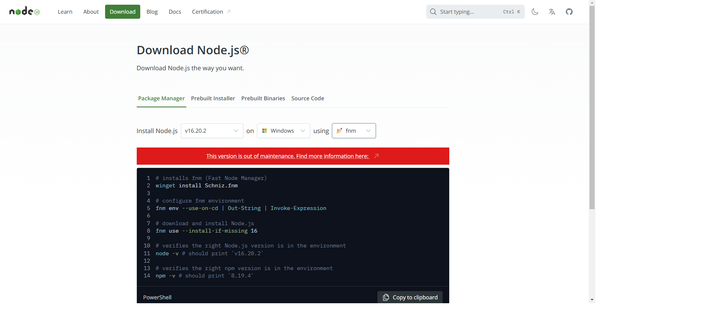
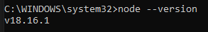
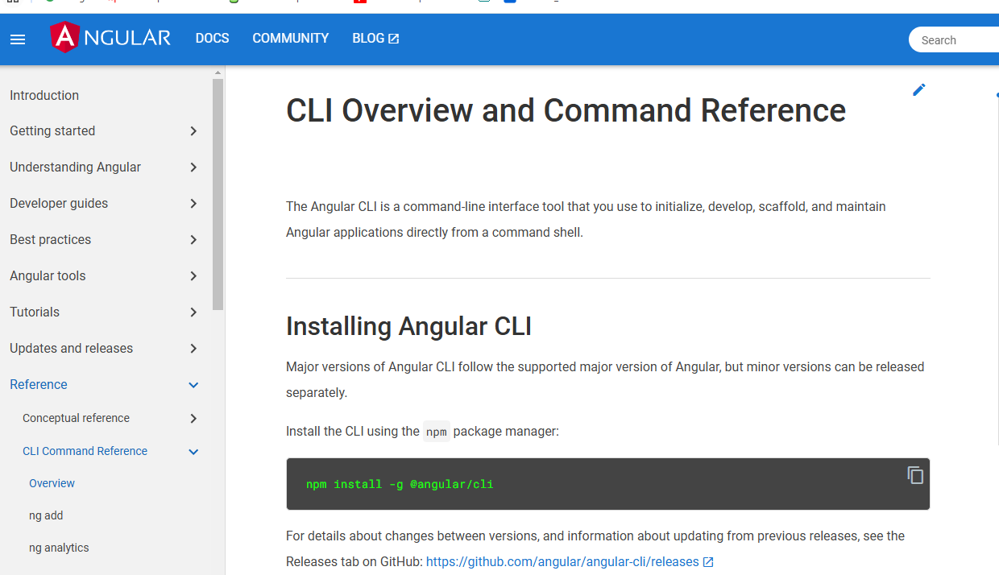
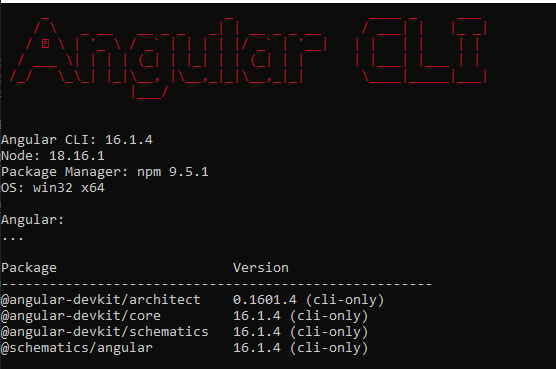

<div style=";border:solid; margin:5px; padding:3%">

<h1> Angular <h1>


<h2>Instalar Node.js</h2>

Ir al link: https://nodejs.org/en/download/package-manager 

<div style="text-align: center;">
  
</div>

<br>

Node.js es un entorno de ejecución de **JavaScript**. En el desarrollo web se usa JavaScript para programar y es leído por los navegadores en tiempo de ejecución.

Una vez instalado verificar la versión en el **cmd**:

```bash
node --version
```

<div style="text-align: center;">
  
</div>

<br>

Al instalar Node.js viene incluido el **npm** __(Node package manager)__, el cual permite descargar distintas librerías, como en este caso **Angular** dentro de un proyecto.

<h2> Instalación de Angular </h2>

Ir al link: https://angular.io/cli 

<div style="text-align: center;">
  
</div>

<br>

**CLI** __(Command Line Interface)__ instala Angular para utilizarlo desde consola, copiar el comando y pegarlo en consola.

```bash
npm install -g @angular/cli
```

Al finalizar la instalación ya podemos utilizar la interfaz de línea de comando de Ángular en cualquier lugar del sistema. El **-g** permite instalar la librería de manera global.

Para verificar que esté bien instalado Angular CLI, colocamos este comando:

```bash
ng version 
```
<div style="text-align: center;">
  
</div>


<br>

</div>


